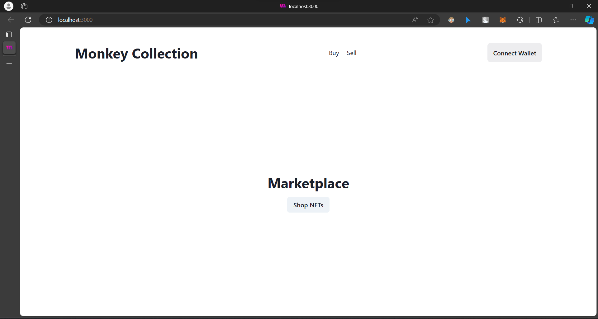
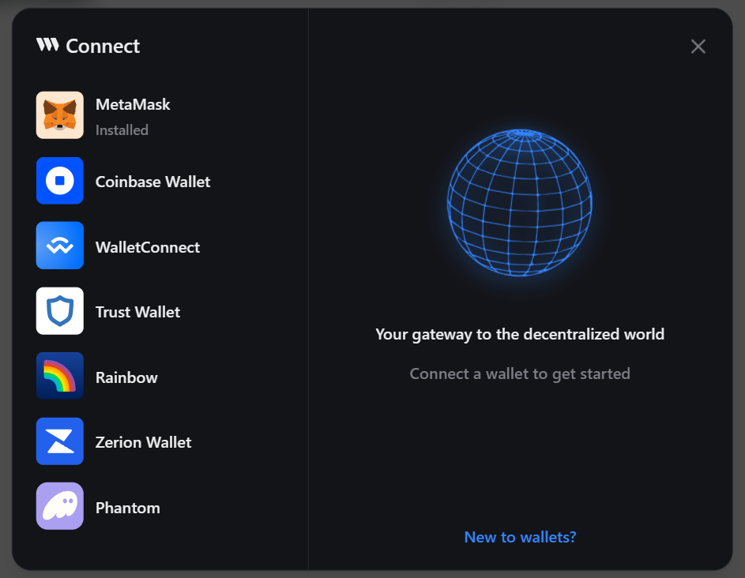
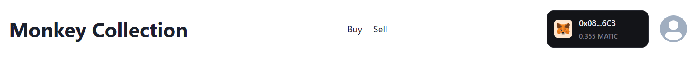
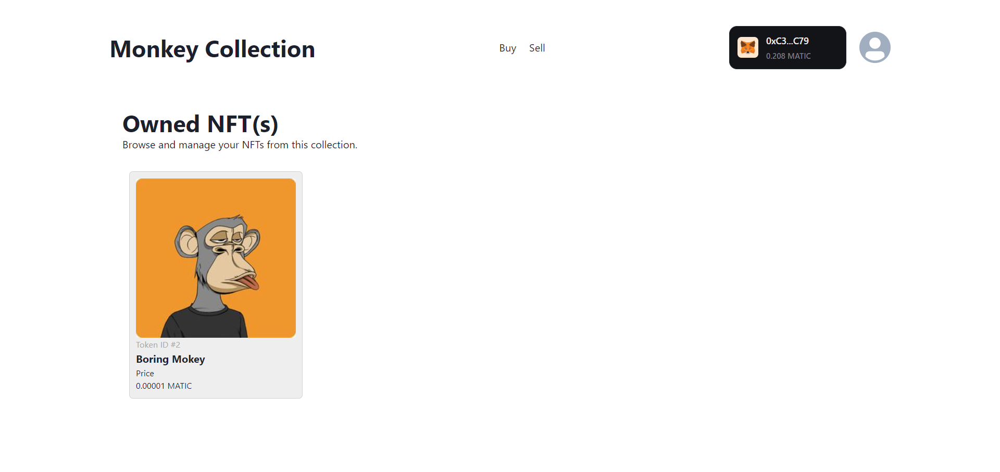

# Monkey Collection Marketplace

## Download Project From Github

Link to the project [here](https://github.com/QuocTrung810/monkey_collection_marketplace)

## Getting Started

To run the project, we need to download external packages into the project according to the command below:

```bash
npm install yarn @chakra-ui/react @emotion/react @emotion/styled framer-motion
```

The npm install command line you provided is to install some npm packages for your project. Let's look at each package one by one:

* `yarn`: Is a JavaScript package manager, often used to manage npm packages more efficiently. It provides the ability to load packages from local clones, create immutable clones, and has many other features compared to npm.
* `@chakra-ui/react`: Is a React library that provides reusable UI components and a built-in design system to help you build user interfaces quickly.
* `@emotion/react and @emotion/styled`: Are libraries that support CSS management in React applications. @emotion/react provides the core API for emotion, while @emotion/styled is a styled-components version of emotion.
* `framer-motion`: Is a library that helps you add motion and animation effects to your React application easily.

## Running Projects

Call the following command in terminal to run the project:

```bash
yarn dev
```

After calling the `yarn dev` command, the website will have the address `http://localhost:3000`

The main interface of the web will be as follows:


## Create a Metamask Account

In this project, we will trade in matic - polygon coins through metamask. After entering the main interface, click the **Connect Wallet** button to enter the interface to connect to the metamask.

**Connect Wallet** interface:


If you still do not have a metamask account, you can follow metamask's instructions to create a wallet.

After you have created a wallet, you can go to [this website](https://mumbaifaucet.com/?fbclid=IwAR2vwur9namv1X5rmmoGuE5WMI_6pXS9DgxOsFqhASpahT1MzzFGbRDvk-8) and provide the wallet adrress id to receive 0.2 matic.

This is the interface after connecting to the wallet:


## Check Purchased Products

After purchasing products from the website, you can click on the user icon on the right side of the wallet to view the purchased products.


## Video Demo

Link [here](https://drive.google.com/file/d/1R9MDThmppRzvcozp7GRg-AhAlWLdnn7W/view?usp=sharing)

## References

* [Thirdweb](https://thirdweb.com/)
* [Bored Ape](https://en.wikipedia.org/wiki/Bored_Ape)
* [Thirweb channel](https://www.youtube.com/watch?v=apyHxCppmbI&t=2268s)
